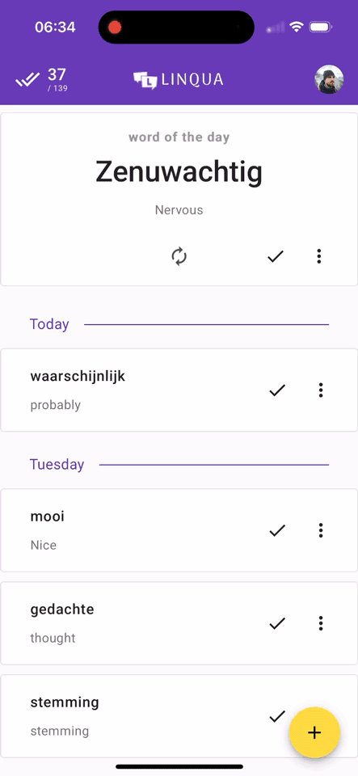

 

# Linqua
## Vacabulary training tool

Whenever you learn a foreign language you usually write down new words/phrases that you need to learn and then come back and go through the list periodically until learned. Linqua is an app with a very simple and intuitive user interface that allows you to do just that. Some of the additional features include:

* Automatic translation to English when you add a word or phrase in a foreign language;
* Going through your words in random order one by one ("word of the day");

## Demo

## License
MIT © Pavlo Glazkov
